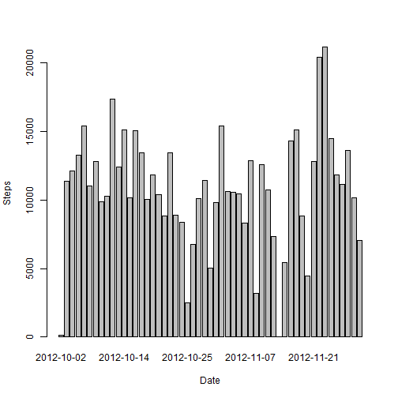
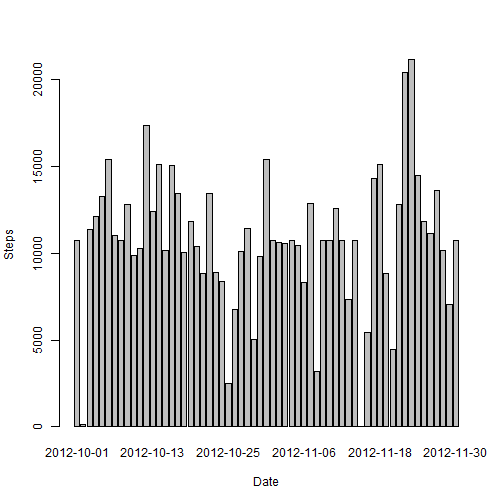
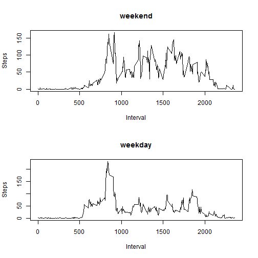

# Reproducible Research: Peer Assessment 1

## Loading and preprocessing the data

First we unzip the activity.zip in this repository, then open and load the csv file


```r
unzip(zipfile = "activity.zip", overwrite = TRUE)
table <- read.csv("./activity.csv")
table$date <- as.Date(table$date)
table$steps <- as.numeric(as.character(table$steps))
table$interval <- as.numeric(as.character(table$interval))
head(table)
```

```
##   steps       date interval
## 1    NA 2012-10-01        0
## 2    NA 2012-10-01        5
## 3    NA 2012-10-01       10
## 4    NA 2012-10-01       15
## 5    NA 2012-10-01       20
## 6    NA 2012-10-01       25
```


Preprocess the data


```r
steps_date <- aggregate(steps ~ date, data = table, FUN = sum)
str(steps_date)
```

```
## 'data.frame':	53 obs. of  2 variables:
##  $ date : Date, format: "2012-10-02" "2012-10-03" ...
##  $ steps: num  126 11352 12116 13294 15420 ...
```


```r
head(steps_date)
```

```
##         date steps
## 1 2012-10-02   126
## 2 2012-10-03 11352
## 3 2012-10-04 12116
## 4 2012-10-05 13294
## 5 2012-10-06 15420
## 6 2012-10-07 11015
```


## What is mean total number of steps taken per day?

Plot a histogram that plot the steps per day.

```r
barplot(steps_date$steps, names.arg = steps_date$date, xlab = "Date", ylab = "Steps")
```



Mean and median are 10766.19 and 10765:


```r
steps_mean <- mean(steps_date$steps)
steps_mean
```

```
## [1] 10766.19
```


```r
steps_median <- median(steps_date$steps)
steps_median
```

```
## [1] 10765
```


## What is the average daily activity pattern?

Plot a time series of the 5-minute interval and the average number of steps taken, averaged across all days


```r
steps_per_day <- aggregate(steps ~ interval, data = table, FUN = mean)
plot(steps_per_day, type = "l", xlab = "Interval", ylab = "Steps")
```


Find the maximum number of steps:


```r
steps_per_day$interval[which.max(steps_per_day$steps)]
```

```
## [1] 835
```


## Imputing missing values

How many missing values in the dataset:


```r
sum(is.na(table))
```

```
## [1] 2304
```


```r
table <- merge(table, steps_per_day, by = "interval", suffixes = c("", ".y"))
na <- is.na(table$steps)
table$steps[na] <- table$steps.y[na]
table <- table[, c(1:3)]
```


compare to the previous figure, the median has changed a little and is now exactly equal to the mean
 
 

```r
steps_date <- aggregate(steps ~ date, data = table, FUN = sum)
barplot(steps_date$steps, names.arg = steps_date$date, xlab = "Date", ylab = "Steps")
```




```r
mean(steps_date$steps)
```

```
## [1] 10766.19
```


```r
median(steps_date$steps)
```

```
## [1] 10766.19
```


## Are there differences in activity patterns between weekdays and weekends?

Find days are either weekdays or weekends.


```r
table$weekdayorend <- ifelse(weekdays(table$date) == "Saturday" | weekdays(table$date) == "Sunday", "weekend", "weekday")
head(table)
```

```
##   interval    steps       date weekdayorend
## 1        0 1.716981 2012-10-01      weekday
## 2        0 0.000000 2012-11-23      weekday
## 3        0 0.000000 2012-10-28      weekend
## 4        0 0.000000 2012-11-06      weekday
## 5        0 0.000000 2012-11-24      weekend
## 6        0 0.000000 2012-11-15      weekday
```


Plot weekend and weekday figures to see the differences:


```r
par(mfrow = c(2, 1))
steps_type <- aggregate(steps ~ interval, data = table, subset = table$weekdayorend == "weekend", FUN = mean)
plot(steps_type, main = "weekend", type = "l", xlab = "Interval", ylab = "Steps")
steps_type <- aggregate(steps ~ interval, data = table, subset = table$weekdayorend == "weekday", FUN = mean)
plot(steps_type, main = "weekday", type = "l", xlab = "Interval", ylab = "Steps")
```



Yes there are differences, for example on weekday it has higher peak.
